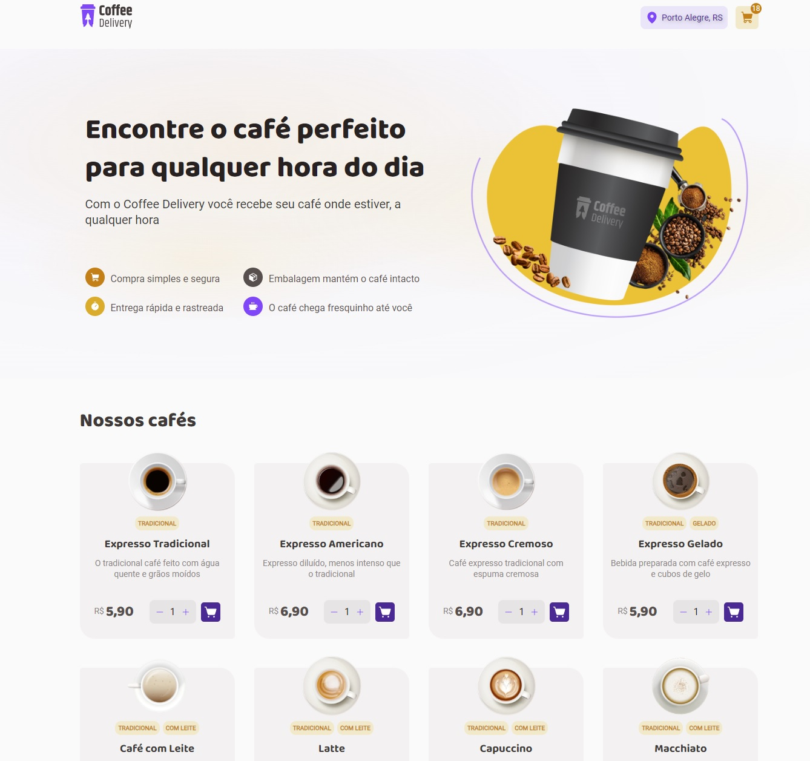

💻 Sobre o projeto
📄 Coffee Delivery - é um projeto desenvolvido como desafio do segundo modulo de react da rocketseat.
A intenção principal do desenvolvimento é reforçar o conhecimento aprendido no curso até o momento.

Temas Utilizados 
- Estados
- ContextAPI
- LocalStorage
- Imutabilidade do estado
- Listas e chaves no ReactJS
- Propriedades
- Componentização

⚙️ Funcionalidades
- Listagem de produtos (cafés) disponíveis para compra
- Adicionar uma quantidade específicas de itens no carrinho
- Aumentar ou remover a quantidade de itens no carrinho
- Formulário para o usuário preencher o seu endereço
- Exibir o total de itens no carrinho no Header
- Exibir o valor total da soma de itens no carrinho multiplicados pelo valor

 width="300" height="200"

